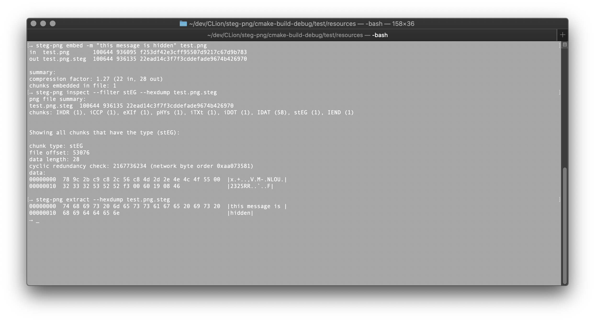
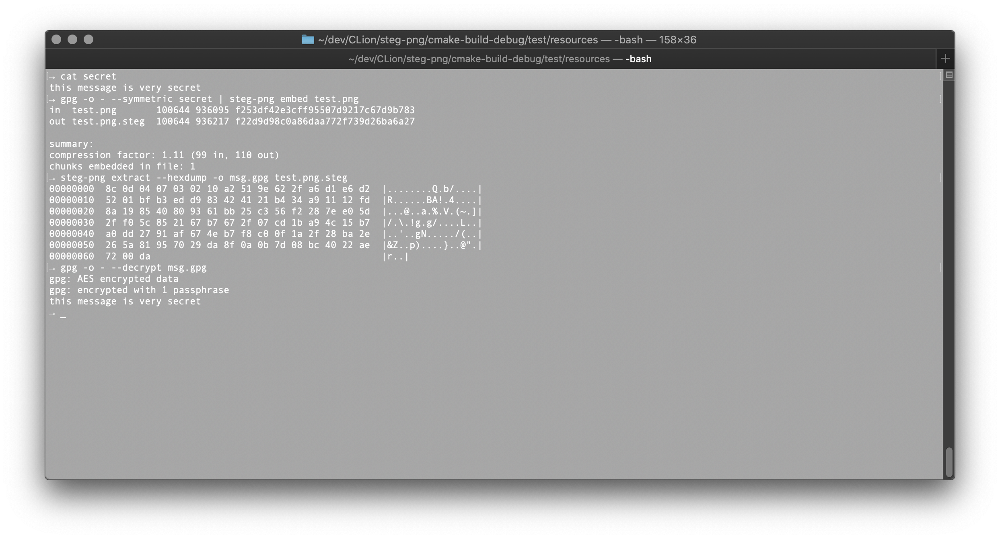

# steg-png
[](https://travis-ci.com/brandon1024/steg-png)

`steg-png` is a simple toolset for embedding data in Portable Network Graphics (PNG) images. This concept is known as steganography, and is useful for concealing hidden messages in otherwise unassuming files.



## How it works
Portable Network Graphics (PNG) images have a pretty simple format. They are composed of an 8-byte file header and a number of data chunks.

Data chunks within the file are split into two groups, known as `critical` and `ancillary`. Critical chunks are necessary for the decoder to be able to decode and display the image. This includes information like color data and dimensions. Ancillary chunks are optional chunks of data that decoders will ignore if unknown to them. There are a number of standard ancillary chunks, but steg-png uses a custom `stEG` type chunk.

Chunks have the following byte structure:

| Length  | Chunk Type | Chunk Data   | CRC     |
|---------|------------|--------------|---------|
| 4 bytes | 4 bytes    | Length bytes | 4 bytes |

steg-png uses the popular [zlib compression library](https://github.com/madler/zlib) to compress the data before embedding in the file. This has the added benefit of obfuscating the message, which will help to mitigate the risk of discovering the message when byte inspecting the file.

You can read more on the specifics of the PNG format in [informational RFC 2083](https://tools.ietf.org/html/rfc2083).

## Building and Installing
By default, steg-png is installed into your user's ~/bin directory. To install, from the project root run:
```bash
$ mkdir build
$ cd build
$ cmake ..
$ make install

$ ~/bin/steg-png --help
```

For a global install, run from the project root:
```bash
$ mkdir build
$ cd build
$ cmake -DCMAKE_INSTALL_PREFIX=/usr/local ..
$ make install

$ steg-png --help
```

## Usage
Using the tool is simple.

```
usage: steg-png embed [options] (-m | --message <message>) <file>
   or: steg-png embed [options] (-f | --file <file>) <file>
   or: steg-png embed (-h | --help)

    -m, --message <message>
                        specify the message to embed in the png image
    -f, --file <file>   specify a file to embed in the png image
    -o, --output <file>
                        output to a specific file
    -l=<n>, --compression-level=<n>
                        alternate compression level (0 none, 1 fastest - 9 slowest)
    -q, --quiet         suppress informational summary to stdout
    -h, --help          show help and exit


usage: steg-png extract [-o | --output <file>] <file>
   or: steg-png extract [--hexdump] <file>
   or: steg-png extract (-h | --help)

    -o, --output <file>
                        alternate output file path
    --hexdump           print a hexdump of the embedded data
    -h, --help          show help and exit


usage: steg-png inspect [(--filter <chunk type>)...] [--critical] [--ancillary] <file>
   or: steg-png inspect [<options>...] --hexdump [--full-source] <file>
   or: steg-png inspect [<options>...] --machine-readable [(-z | --nul)] <file>
   or: steg-png inspect (-h | --help)

    --hexdump           print a canonical hex+ASCII hexdump of chunk data as it appears in the file
    --full-source       show full hexdump of chunk as it appears in the file (including control bytes)
                        show chunks with specific type
    --critical          show critical chunks
    --ancillary         show ancillary chunks
    --machine-readable
                        show output in machine-readable format
    -z, --nul           terminate lines with NUL byte instead of line feed
    -h, --help          show help and exit

```

## Example Usage
### Embed Plaintext Messages
```bash
$ ls
test.png
$ steg-png embed -m "my message" -o secret.png test.png
in  test.png    100644 936095 f253df42e3cff95507d9217c67d9b783
out secret.png  100644 936125 85c49de24312d40e79b6f6697b71e75d

summary:
compression factor: 1.80 (10 in, 18 out)
chunks embedded in file: 1
$ ls
test.png
secret.png
```

### Embed Arbitrary Data
```bash
$ ls
execute-me.sh
test.png
$ steg-png embed -f execute-me.sh -o secret.png test.png
in  test.png    100644 936095 f253df42e3cff95507d9217c67d9b783
out secret.png  100644 936247 2f0cd83b221c56388378c83a3ff051fe

summary:
compression factor: 0.72 (195 in, 140 out)
chunks embedded in file: 1
$ ls
test.png
secret.png
```

### Extracting Plaintext Messages
```bash
$ ls
test.png
secret.png
$ steg-png extract -o secret secret.png
$ cat secret
hello!
```

### Extracting Arbitrary Data
```bash
$ ls
secret.png
$ steg-png extract -o execute-me.sh secret.png
$ chmod +x execute-me.sh
$ ./execute-me.sh
hello!
```

### Visualizing Embedded Data
```bash
$ ls
secret.png
$ steg-png extract --hexdump secret.png
00000000  68 65 6c 6c 6f 21                                |hello!|
```

### Inspecting Embedded Data
```bash
$ ls
secret.png
$ steg-png inspect --filter stEG --hexdump secret.png
png file summary:
secret.png  100644 936121 263b5b0d7a80d9ffe66ff22c195a46ae
chunks: IHDR (1), iCCP (1), stEG (1), eXIf (1), pHYs (1), iTXt (1), iDOT (1), IDAT (58), IEND (1)


Showing all chunks that have the type (stEG):

chunk type: stEG
file offset: 3193
data length: 14
cyclic redundancy check: 3196852778 (network byte order 0x2a1a8cbe)
data:
00000000  78 9c cb 48 cd c9 c9 57 04 00 08 62 02 36        |x..H...W...b.6|
```

### Inspecting PNG File Structure
```bash
$ ls
secret.png
$ steg-png inspect --critical secret.png
png file summary:
secret.png  100644 936121 263b5b0d7a80d9ffe66ff22c195a46ae
chunks: IHDR (1), iCCP (1), stEG (1), eXIf (1), pHYs (1), iTXt (1), iDOT (1), IDAT (58), IEND (1)


Showing all chunks that are critical:

chunk type: IHDR
file offset: 8
data length: 13
cyclic redundancy check: 3390785450 (network byte order 0xaa471bca)

chunk type: IDAT
file offset: 3914
data length: 16384
cyclic redundancy check: 1642937807 (network byte order 0xcf3ded61)

chunk type: IDAT
file offset: 20310
data length: 16384
cyclic redundancy check: 3415450082 (network byte order 0xe2a193cb)

.... (truncated for brevity)

chunk type: IDAT
file offset: 914064
data length: 16384
cyclic redundancy check: 2329633380 (network byte order 0x6462db8a)

chunk type: IDAT
file offset: 930460
data length: 5637
cyclic redundancy check: 726346680 (network byte order 0xb82b4b2b)

chunk type: IEND
file offset: 936109
data length: 0
cyclic redundancy check: 2923585666 (network byte order 0x826042ae)
```

### Parsing PNG File Structure
```bash
$ ls
secret.png
$ # --machine-readable format: <chunk type> <file offset> <data segment length> <32-bit CRC host byte order>
$ steg-png inspect --machine-readable secret.png
IHDR 8 13 3390785450
iCCP 33 3148 3073351896
stEG 3193 14 3196852778
eXIf 3219 138 1200866906
pHYs 3369 9 1230120176
iTXt 3390 472 2924188147
iDOT 3874 28 2081801688
IDAT 3914 16384 1642937807
IDAT 20310 16384 3415450082
IDAT 36706 16384 3616936176
IDAT 53102 16384 2514028901
IDAT 69498 16384 3690291837
IDAT 85894 16384 627990634
IDAT 102290 16384 4187174932
IDAT 118686 16384 3102413329
IDAT 135082 16384 1513502627
IDAT 151478 16384 1326204536
IDAT 167874 16384 3316197314
IDAT 184270 16384 1125484417
IDAT 200666 16384 3644326412
IDAT 217062 16384 3944643344
IDAT 233458 16384 3865921331
IDAT 249854 16384 2067871703
IDAT 266250 16384 823706138
IDAT 282646 16384 3387257625
IDAT 299042 16384 644280890
IDAT 315438 16384 433218780
IDAT 331834 16384 3980611312
IDAT 348230 16384 355444652
IDAT 364626 16384 638721223
IDAT 381022 16384 2188694194
IDAT 397418 16384 2926094770
IDAT 413814 16384 2441488258
IDAT 430210 16384 3376083075
IDAT 446606 16384 1731962082
IDAT 463002 16384 3053040069
IDAT 479398 16384 727178856
IDAT 495794 16384 4208257611
IDAT 512190 16384 3797531557
IDAT 528586 16384 2175258547
IDAT 544982 8358 2458139397
IDAT 553352 16384 1977755237
IDAT 569748 16384 2250206215
IDAT 586144 16384 1969696234
IDAT 602540 16384 2909082706
IDAT 618936 16384 378917002
IDAT 635332 16384 536186543
IDAT 651728 16384 1043374053
IDAT 668124 16384 3504837883
IDAT 684520 16384 3370061706
IDAT 700916 16384 3276306620
IDAT 717312 16384 3425131976
IDAT 733708 16384 134843265
IDAT 750104 16384 267958489
IDAT 766500 16384 2259678566
IDAT 782896 16384 1549130947
IDAT 799292 16384 865128891
IDAT 815688 16384 2935915479
IDAT 832084 16384 3787543213
IDAT 848480 16384 2961472929
IDAT 864876 16384 2940432080
IDAT 881272 16384 396352217
IDAT 897668 16384 3408016487
IDAT 914064 16384 2329633380
IDAT 930460 5637 726346680
IEND 936109 0 2923585666
```

## Using steg-png with GNU Privacy Guard (GPG)
When no message is provided, steg-png will accept input from stdin. This is useful when using steg-png with GPG.

For instance, you could encrypt a message symmetrically before embedding in the file:
```
echo "my secret message" > message_in
gpg -o - --armor --symmetric message_in | steg-png embed example.png
```



## License
This project is free software and is available under the [MIT License](https://opensource.org/licenses/MIT).
