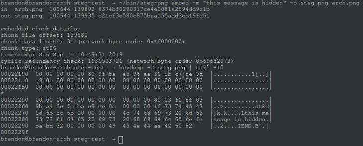

# steg-png
`steg-png` is a simple C-based commandline application that can be used to embed data in Portable Network Graphics (PNG) images. This concept is known as steganography, and is useful for concealing hidden messages in otherwise unassuming files.



## How it works
Portable Network Graphics (PNG) images have a pretty simple format. They are composed of an 8-byte file header and a number of data chunks.

Data chunks within the file are split into two groups, known as `critical` and `ancillary`. Critical chunks are necessary for the decoder to be able to decode and display the image. This includes information like color data and dimensions. Ancillary chunks are optional chunks of data that decoders will ignore if unknown to them. There are a number of standard ancillary chunks, but steg-png uses a custom `stEG` type chunk.

Chunks have the following byte structure:

| Length  | Chunk Type | Chunk Data   | CRC     |
|---------|------------|--------------|---------|
| 4 bytes | 4 bytes    | Length bytes | 4 bytes |

steg-png uses the popular [zlib compression library](https://github.com/madler/zlib) to compress the data before embedding in the file. This has the added benefit of obfuscating the message, which will help to mitigate the risk of discovering the message when byte inspecting the file.

You can read more on the specifics of the PNG format in [informational RFC 2083](https://tools.ietf.org/html/rfc2083).

## Building and Installing
By default, steg-png is installed into your user's ~/bin directory. To install, from the project root run:
```
$ mkdir build
$ cd build
$ cmake ..
$ make install

$ ~/bin/steg-png --help
```

For a global install, run from the project root:
```
$ mkdir build
$ cd build
$ cmake -DCMAKE_INSTALL_PREFIX=/usr/local ..
$ make install

$ steg-png --help
```

## Usage
Using the tool is simple.

```
usage: steg-png embed [options] (-m | --message <message>) <file>
   or: steg-png embed [options] (-f | --file <file>) <file>
   or: steg-png embed (-h | --help)

    -m, --message <message>
                        specify the message to embed in the png image
    -f, --file <file>   specify a file to embed in the png image
    -o, --output <file>
                        output to a specific file
    -l=<n>, --compression-level=<n>
                        alternate compression level (0 none, 1 fastest - 9 slowest)
    -q, --quiet         suppress informational summary to stdout
    -h, --help          show help and exit
```

## Using steg-png with GNU Privacy Guard (GPG)
When no message is provided, steg-png will accept input from stdin. This is useful when using steg-png with GPG.

For instance, you could encrypt a message symmetrically before embedding in the file:
```
echo "my secret message" > message_in
gpg -o - --armor --symmetric message_in | steg-png embed example.png
```

## License
This project is free software and is available under the [MIT License](https://opensource.org/licenses/MIT).
